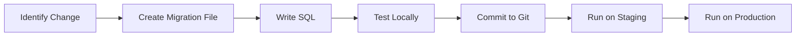

# 🔄 Database Migration Guide

## Overview

This guide explains how to safely manage database changes as your QuadraJá application evolves.

## 📋 Migration Best Practices

### 1. **Always Use Migration Files**
- ✅ DO: Create timestamped migration files
- ❌ DON'T: Make direct changes in SQL Editor without saving them
- ❌ DON'T: Manually edit data that should be handled by migrations

### 2. **Never Modify Existing Migrations**
- Once a migration is committed and deployed, treat it as immutable
- If you need to change something, create a NEW migration to fix it

### 3. **Test Locally First**
- Always test migrations on a development/staging database before production

---

## 🆕 Creating New Migrations

### Step 1: Create a New Migration File

Migration files follow this naming convention:
```
YYYYMMDDHHMMSS_description_of_change.sql
```

**Example:**
```bash
# Create a new migration file
touch supabase/migrations/$(date +%Y%m%d%H%M%S)_add_court_photos_table.sql
```

Or manually create:
```
supabase/migrations/20251107150000_add_court_photos_table.sql
```

### Step 2: Write Your Migration SQL

Open the new file and write your changes:

```sql
/*
  # Add Court Photos Feature

  ## Changes
  - Create court_photos table for multiple photos per court
  - Add foreign key to courts table
  - Set up RLS policies

  ## Security
  - Public can view photos
  - Only court owners can add/delete photos
*/

-- Create court_photos table
CREATE TABLE IF NOT EXISTS court_photos (
  id uuid PRIMARY KEY DEFAULT gen_random_uuid(),
  court_id uuid NOT NULL REFERENCES courts(id) ON DELETE CASCADE,
  photo_url text NOT NULL,
  display_order int DEFAULT 0,
  created_at timestamptz DEFAULT now()
);

-- Create index for faster queries
CREATE INDEX IF NOT EXISTS court_photos_court_id_idx ON court_photos(court_id);

-- Enable RLS
ALTER TABLE court_photos ENABLE ROW LEVEL SECURITY;

-- Anyone can view photos
CREATE POLICY "Anyone can view court photos"
  ON court_photos FOR SELECT
  TO anon, authenticated
  USING (true);

-- Court owners can insert photos
CREATE POLICY "Court owners can add photos"
  ON court_photos FOR INSERT
  TO authenticated
  WITH CHECK (
    EXISTS (
      SELECT 1 FROM courts
      WHERE courts.id = court_photos.court_id
      AND courts.owner_id = auth.uid()
    )
  );

-- Court owners can delete their photos
CREATE POLICY "Court owners can delete photos"
  ON court_photos FOR DELETE
  TO authenticated
  USING (
    EXISTS (
      SELECT 1 FROM courts
      WHERE courts.id = court_photos.court_id
      AND courts.owner_id = auth.uid()
    )
  );
```

### Step 3: Run the Migration

**Using Supabase Dashboard (Recommended):**
1. Open SQL Editor: https://supabase.com/dashboard/project/hegqofubmkhmwjvpssdi/sql/new
2. Copy the contents of your new migration file
3. Paste and click "Run"

**Using Node Script (if you have DB password):**
```bash
# Add your new migration to the migrations folder
# Then run:
node run-migrations-pg.js
```

### Step 4: Test the Changes

```bash
# Restart your dev server
npm run dev

# Test the new feature in your app
```

---

## 📝 Common Migration Scenarios

### Adding a New Column

```sql
-- Migration: 20251107150000_add_verified_to_profiles.sql

-- Add new column
ALTER TABLE profiles 
ADD COLUMN IF NOT EXISTS verified boolean DEFAULT false;

-- Add index if needed for queries
CREATE INDEX IF NOT EXISTS profiles_verified_idx ON profiles(verified);

-- Update existing rows if needed
UPDATE profiles SET verified = true WHERE user_role = 'club_owner';
```

### Adding a New Table

```sql
-- Migration: 20251107160000_add_reviews_table.sql

CREATE TABLE IF NOT EXISTS reviews (
  id uuid PRIMARY KEY DEFAULT gen_random_uuid(),
  court_id uuid NOT NULL REFERENCES courts(id) ON DELETE CASCADE,
  user_id uuid NOT NULL REFERENCES profiles(id) ON DELETE CASCADE,
  rating int NOT NULL CHECK (rating >= 1 AND rating <= 5),
  comment text,
  created_at timestamptz DEFAULT now(),
  updated_at timestamptz DEFAULT now(),
  -- Prevent duplicate reviews from same user
  UNIQUE(court_id, user_id)
);

-- Indexes
CREATE INDEX IF NOT EXISTS reviews_court_id_idx ON reviews(court_id);
CREATE INDEX IF NOT EXISTS reviews_user_id_idx ON reviews(user_id);

-- RLS Policies
ALTER TABLE reviews ENABLE ROW LEVEL SECURITY;

CREATE POLICY "Anyone can view reviews"
  ON reviews FOR SELECT
  TO anon, authenticated
  USING (true);

CREATE POLICY "Users can create reviews"
  ON reviews FOR INSERT
  TO authenticated
  WITH CHECK (user_id = auth.uid());

CREATE POLICY "Users can update own reviews"
  ON reviews FOR UPDATE
  TO authenticated
  USING (user_id = auth.uid())
  WITH CHECK (user_id = auth.uid());

CREATE POLICY "Users can delete own reviews"
  ON reviews FOR DELETE
  TO authenticated
  USING (user_id = auth.uid());
```

### Modifying Existing Policies

```sql
-- Migration: 20251107170000_update_bookings_policies.sql

-- Drop old policy
DROP POLICY IF EXISTS "Users can create own bookings" ON bookings;

-- Create new policy with additional checks
CREATE POLICY "Users can create own bookings"
  ON bookings FOR INSERT
  TO authenticated
  WITH CHECK (
    user_id = auth.uid()
    AND start_time < end_time  -- Ensure valid time range
    AND booking_date >= CURRENT_DATE  -- No past bookings
  );
```

### Adding Constraints

```sql
-- Migration: 20251107180000_add_booking_constraints.sql

-- Add check constraint
ALTER TABLE bookings 
ADD CONSTRAINT booking_time_valid 
CHECK (start_time < end_time);

-- Add unique constraint (prevent double booking)
CREATE UNIQUE INDEX IF NOT EXISTS bookings_no_overlap_idx 
ON bookings(court_id, booking_date, start_time) 
WHERE status = 'confirmed';
```

### Renaming Columns (Careful!)

```sql
-- Migration: 20251107190000_rename_column.sql

-- Rename column
ALTER TABLE courts 
RENAME COLUMN price_per_hour TO hourly_rate;

-- Note: You may need to update RLS policies if they reference the old name
```

### Dropping Columns (Very Careful!)

```sql
-- Migration: 20251107200000_remove_unused_column.sql

-- First, ensure no code references this column
-- Then, drop it
ALTER TABLE courts 
DROP COLUMN IF EXISTS old_field_name;

-- Consider keeping a backup or making this reversible
```

---

## 🔄 Migration Workflow

### For Development



### For Production

1. **Create migration locally**
   ```bash
   touch supabase/migrations/$(date +%Y%m%d%H%M%S)_description.sql
   ```

2. **Write and test migration**
   - Write SQL changes
   - Test in local/dev database
   - Verify app still works

3. **Commit to version control**
   ```bash
   git add supabase/migrations/
   git commit -m "Add migration: description"
   git push
   ```

4. **Deploy to staging** (if you have one)
   - Run migration on staging database
   - Test thoroughly

5. **Deploy to production**
   - Run migration on production database
   - Monitor for issues

---

## 🚨 Rollback Strategy

### Creating Reversible Migrations

Always think about how to undo changes:

```sql
-- Migration: 20251107210000_add_feature.sql

-- ============================================
-- FORWARD MIGRATION (Apply changes)
-- ============================================

CREATE TABLE IF NOT EXISTS new_table (
  id uuid PRIMARY KEY DEFAULT gen_random_uuid(),
  name text NOT NULL,
  created_at timestamptz DEFAULT now()
);

-- ============================================
-- ROLLBACK INSTRUCTIONS (if needed)
-- ============================================
-- To rollback, create a new migration with:
-- DROP TABLE IF EXISTS new_table;
```

### If Something Goes Wrong

**Option 1: Create a rollback migration**
```sql
-- Migration: 20251107211000_rollback_previous_change.sql
DROP TABLE IF EXISTS new_table;
```

**Option 2: Use Supabase Point-in-Time Recovery (Enterprise)**
- Restore to a point before the migration
- Only available on paid plans

---

## 📊 Migration Checklist

Before running any migration:

- [ ] Migration file has timestamp in name
- [ ] SQL is idempotent (safe to run multiple times)
- [ ] Uses `IF EXISTS` / `IF NOT EXISTS` where appropriate
- [ ] Includes comments explaining the change
- [ ] RLS policies updated if needed
- [ ] Indexes added for performance
- [ ] Tested locally
- [ ] Committed to version control
- [ ] Rollback plan documented

---

## 🔧 Useful SQL Patterns

### Check if Column Exists Before Adding

```sql
DO $$
BEGIN
  IF NOT EXISTS (
    SELECT 1 FROM information_schema.columns
    WHERE table_name = 'your_table' AND column_name = 'new_column'
  ) THEN
    ALTER TABLE your_table ADD COLUMN new_column text;
  END IF;
END $$;
```

### Safely Add Enum Values

```sql
-- If using enums, add values safely
DO $$
BEGIN
  IF NOT EXISTS (
    SELECT 1 FROM pg_type t 
    JOIN pg_enum e ON t.oid = e.enumtypid 
    WHERE t.typname = 'your_enum' AND e.enumlabel = 'new_value'
  ) THEN
    ALTER TYPE your_enum ADD VALUE 'new_value';
  END IF;
END $$;
```

### Batch Updates for Large Tables

```sql
-- For large tables, update in batches
DO $$
DECLARE
  batch_size INT := 1000;
  updated_rows INT;
BEGIN
  LOOP
    UPDATE your_table
    SET new_column = 'value'
    WHERE id IN (
      SELECT id FROM your_table
      WHERE new_column IS NULL
      LIMIT batch_size
    );
    
    GET DIAGNOSTICS updated_rows = ROW_COUNT;
    EXIT WHEN updated_rows = 0;
    
    -- Pause between batches
    PERFORM pg_sleep(0.1);
  END LOOP;
END $$;
```

---

## 🔍 Debugging Migrations

### Check What Tables Exist

```sql
SELECT table_name 
FROM information_schema.tables 
WHERE table_schema = 'public'
ORDER BY table_name;
```

### Check RLS Policies

```sql
SELECT schemaname, tablename, policyname, permissive, roles, cmd, qual
FROM pg_policies
WHERE schemaname = 'public'
ORDER BY tablename, policyname;
```

### Check Indexes

```sql
SELECT
    tablename,
    indexname,
    indexdef
FROM pg_indexes
WHERE schemaname = 'public'
ORDER BY tablename, indexname;
```

### Check Constraints

```sql
SELECT
    con.conname AS constraint_name,
    tbl.relname AS table_name,
    col.attname AS column_name,
    pg_get_constraintdef(con.oid) AS constraint_def
FROM pg_constraint con
JOIN pg_class tbl ON con.conrelid = tbl.oid
JOIN pg_attribute col ON col.attrelid = tbl.oid
WHERE tbl.relnamespace = 'public'::regnamespace
ORDER BY tbl.relname, con.conname;
```

---

## 📚 Quick Reference

### Migration File Template

```sql
/*
  # [Feature Name]

  ## Changes
  - List what changes this migration makes

  ## Why
  - Brief explanation of why this change is needed

  ## Security
  - How RLS policies are affected
  - Who can access the new data

  ## Rollback
  - How to undo this migration if needed
*/

-- Your SQL here

-- Create tables
CREATE TABLE IF NOT EXISTS ...;

-- Add columns
ALTER TABLE ... ADD COLUMN IF NOT EXISTS ...;

-- Create indexes
CREATE INDEX IF NOT EXISTS ...;

-- Update RLS
ALTER TABLE ... ENABLE ROW LEVEL SECURITY;
CREATE POLICY ... ON ... FOR ... TO ... USING (...);

-- Seed data (if needed)
INSERT INTO ... VALUES ... ON CONFLICT DO NOTHING;
```

---

## 🎯 Next Steps

1. **When you need to make a database change:**
   - Create a new timestamped migration file
   - Write your SQL following the patterns above
   - Test locally
   - Run on production

2. **Keep migrations organized:**
   - One logical change per migration
   - Clear, descriptive names
   - Well-commented SQL

3. **Document everything:**
   - Add comments to your SQL
   - Update app documentation if needed
   - Keep track of schema changes

---

## 💡 Pro Tips

1. **Use transactions** for complex migrations
2. **Test rollback** before deploying
3. **Monitor** after deploying migrations
4. **Back up** before major changes
5. **Version control** everything
6. **Keep migrations small** and focused
7. **Document breaking changes** clearly

---

**Remember:** Good migrations are:
- ✅ Incremental
- ✅ Reversible
- ✅ Well-tested
- ✅ Documented
- ✅ Version controlled

Happy migrating! 🚀

