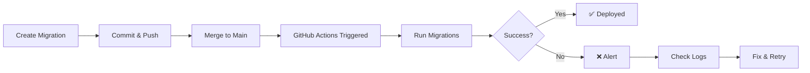

# 🚀 Automated Database Migration Pipeline - Summary

## What Was Created

Your repository now has a fully automated GitHub Actions pipeline for deploying Supabase database migrations!

## 📁 New Files Created

### 1. `.github/workflows/deploy-migrations.yml`
**Main workflow file** - The GitHub Actions pipeline that:
- ✅ Automatically runs migrations when merged to main
- ✅ Detects changes in migration files
- ✅ Provides detailed deployment logs
- ✅ Creates deployment summaries
- ✅ Handles errors gracefully
- ✅ Supports manual triggers

### 2. `GITHUB_ACTIONS_SETUP.md`
**Complete setup guide** covering:
- Step-by-step setup instructions
- Secrets configuration
- Testing procedures
- Troubleshooting guide
- Security best practices
- Advanced configuration options

### 3. `.github/SECRETS_TEMPLATE.md`
**Secrets configuration template** with:
- Required secrets list
- Where to find values in Supabase
- How to add secrets to GitHub
- Security warnings and best practices
- Verification steps

### 4. `.github/QUICK_REFERENCE.md`
**Quick reference card** for:
- Common commands
- Git workflows
- Troubleshooting
- Migration templates
- Emergency procedures
- Pro tips

### 5. `DEPLOYMENT_PIPELINE_SUMMARY.md` (this file)
**Project overview** - What was created and how to use it

---

## 🎯 How It Works



### Workflow Steps:

1. **Developer creates migration** → `npm run db:new`
2. **Test locally** → `npm run db:migrate`
3. **Commit to feature branch** → `git commit -m "feat: new migration"`
4. **Create Pull Request** → Review changes
5. **Merge to main** → GitHub Actions automatically triggered
6. **Pipeline runs migrations** → Applies changes to production database
7. **Success notification** → Deployment complete! 🎉

---

## ⚡ Quick Start (First Time Setup)

### Step 1: Configure GitHub Secrets (5 minutes)

1. Go to your repository on GitHub
2. Click **Settings** → **Secrets and variables** → **Actions**
3. Click **New repository secret**
4. Add these two secrets:

```
Name: SUPABASE_URL
Value: https://YOUR-PROJECT.supabase.co

Name: SUPABASE_SERVICE_ROLE_KEY
Value: eyJhbGciOiJIUzI1NiIsInR5cCI6IkpXVCJ9...
```

**Where to find these values:**
- Supabase Dashboard → Settings → API
- Copy "Project URL" and "service_role" key

### Step 2: Test the Pipeline (2 minutes)

```bash
# Create a test migration
npm run db:new

# Edit the migration file (add a simple comment or test table)
# Then:
git add supabase/migrations/
git commit -m "test: verify pipeline works"
git push origin main

# Watch it deploy automatically!
# Go to: GitHub → Actions tab
```

### Step 3: Celebrate! 🎉

Your migrations now deploy automatically on every merge to main!

---

## 🔍 What Triggers the Pipeline?

| Trigger | Description | Auto-runs? |
|---------|-------------|------------|
| 📝 Merge to Main | PR merged or direct push to main | ✅ Yes |
| 📂 Migration Files | Changes to `supabase/migrations/*.sql` | ✅ Yes |
| 🎯 Manual Run | Click "Run workflow" in Actions tab | Manual |
| 📋 Other Changes | Code changes without migration changes | ❌ Skips |

---

## 📊 Monitoring Your Deployments

### View in GitHub
1. Go to **Actions** tab in your repository
2. Click **Deploy Database Migrations**
3. See all workflow runs with status:
   - 🟢 **Success** - Migration deployed
   - 🔴 **Failure** - Check logs for errors
   - 🟡 **In Progress** - Currently running
   - ⚪ **Skipped** - No changes detected

### View Logs
- Click any workflow run
- See detailed step-by-step execution
- View migration output
- Check deployment summary

---

## 🛡️ Security Features

✅ **Credentials Protected**
- All credentials stored in GitHub Secrets
- Never exposed in logs
- Encrypted at rest

✅ **Concurrency Control**
- Only one migration runs at a time
- Prevents race conditions

✅ **Timeout Protection**
- 10-minute timeout on workflow
- Prevents hanging jobs

✅ **Change Detection**
- Only runs when migrations change
- Saves resources

✅ **Detailed Logging**
- Full audit trail
- Easy troubleshooting
- Deployment summaries

---

## 📚 Documentation Reference

| Document | Purpose | When to Use |
|----------|---------|-------------|
| `GITHUB_ACTIONS_SETUP.md` | Complete setup guide | First time setup, troubleshooting |
| `.github/SECRETS_TEMPLATE.md` | Secrets configuration | Setting up credentials |
| `.github/QUICK_REFERENCE.md` | Quick commands & tips | Daily development |
| `DEPLOYMENT_PIPELINE_SUMMARY.md` | This overview | Understanding the system |

---

## 🎨 Example: Creating and Deploying a Migration

### Scenario: Add a new "reviews" table

```bash
# 1. Create migration file
npm run db:new
# Creates: supabase/migrations/20251107_add_reviews_table.sql

# 2. Edit the migration
cat > supabase/migrations/20251107*.sql << 'EOF'
-- Add reviews table
CREATE TABLE IF NOT EXISTS reviews (
  id uuid PRIMARY KEY DEFAULT gen_random_uuid(),
  court_id uuid REFERENCES courts(id) ON DELETE CASCADE,
  user_id uuid REFERENCES profiles(id) ON DELETE CASCADE,
  rating integer NOT NULL CHECK (rating BETWEEN 1 AND 5),
  comment text,
  created_at timestamptz DEFAULT now()
);

ALTER TABLE reviews ENABLE ROW LEVEL SECURITY;

CREATE POLICY "Users can view all reviews"
  ON reviews FOR SELECT
  TO authenticated
  USING (true);

CREATE POLICY "Users can create own reviews"
  ON reviews FOR INSERT
  TO authenticated
  WITH CHECK (user_id = auth.uid());
EOF

# 3. Test locally
npm run db:migrate
# Output: ✅ Success: 20251107_add_reviews_table.sql

# 4. Commit and push
git checkout -b feature/add-reviews
git add supabase/migrations/
git commit -m "feat: add reviews table for court ratings"
git push origin feature/add-reviews

# 5. Create PR on GitHub
# 6. Review and merge to main

# 7. Watch automatic deployment in Actions tab!
# Output: ✨ Database migrations completed successfully!
```

---

## 🔧 Common Operations

### Create & Deploy Migration
```bash
npm run db:new              # Create new migration
# Edit file...
npm run db:migrate          # Test locally
git add supabase/migrations/
git commit -m "feat: description"
git push origin main        # Auto-deploys!
```

### Manual Deployment
```bash
# Via GitHub web interface:
# Actions → Deploy Database Migrations → Run workflow

# Via GitHub CLI:
gh workflow run "Deploy Database Migrations"
```

### Check Deployment Status
```bash
# Via GitHub CLI:
gh run list --limit 5
gh run watch

# Via browser:
open https://github.com/YOUR-USERNAME/YOUR-REPO/actions
```

---

## 🚨 Troubleshooting Quick Guide

### Issue: Workflow Doesn't Trigger
- ✅ Check: Changes in `supabase/migrations/`?
- ✅ Check: Pushed to `main` branch?
- ✅ Check: GitHub Actions enabled?

### Issue: "Missing Secrets"
- ✅ Add both required secrets
- ✅ Check spelling (case-sensitive)
- ✅ Verify values are correct

### Issue: "Connection Failed"
- ✅ Verify Supabase URL is correct
- ✅ Check service role key is valid
- ✅ Confirm Supabase project is active

### Issue: Migration Already Exists
- ℹ️ This is normal and safe
- ℹ️ Script skips already-applied migrations
- ✅ Check which migrations ran successfully

**For detailed troubleshooting:** See `GITHUB_ACTIONS_SETUP.md`

---

## 💡 Best Practices

### ✅ Do's
- Test all migrations locally first
- Use descriptive migration names
- Include rollback instructions in comments
- Review migration PRs carefully
- Monitor first few automated deployments
- Keep migrations small and focused
- Use `IF NOT EXISTS` for idempotency

### ❌ Don'ts
- Don't commit `.env` files
- Don't skip local testing
- Don't run destructive migrations without backup
- Don't hardcode credentials
- Don't merge without review
- Don't push directly to main (use PRs)

---

## 📈 What's Next?

### Optional Enhancements

1. **Add Slack Notifications**
   - Get notified on deployment success/failure
   - See workflow guide for setup

2. **Set Up Staging Environment**
   - Test migrations in staging first
   - Separate GitHub environment

3. **Add Required Reviewers**
   - Require approval before deployment
   - Settings → Environments → Protection rules

4. **Database Backups**
   - Schedule automatic backups
   - Before major migrations

5. **Monitoring Dashboard**
   - Track deployment frequency
   - Monitor success rates

---

## 🎯 Success Metrics

With this pipeline, you now have:

- ⚡ **Faster Deployments** - Automated in minutes
- 🛡️ **Safer Migrations** - Tested before production
- 📊 **Better Visibility** - Full deployment history
- 🔒 **Improved Security** - Credentials protected
- 📝 **Audit Trail** - All changes tracked
- 🚀 **Consistent Process** - Same workflow every time

---

## 🆘 Need Help?

### Quick Links
- **Setup Guide:** `GITHUB_ACTIONS_SETUP.md`
- **Quick Reference:** `.github/QUICK_REFERENCE.md`
- **Secrets Template:** `.github/SECRETS_TEMPLATE.md`
- **Workflow File:** `.github/workflows/deploy-migrations.yml`

### External Resources
- [GitHub Actions Docs](https://docs.github.com/en/actions)
- [Supabase CLI Guide](https://supabase.com/docs/guides/cli)
- [Supabase Migrations](https://supabase.com/docs/guides/cli/local-development#database-migrations)

---

## ✅ Setup Checklist

- [ ] Read this summary document
- [ ] Review workflow file: `.github/workflows/deploy-migrations.yml`
- [ ] Configure GitHub Secrets (see `GITHUB_ACTIONS_SETUP.md`)
- [ ] Test pipeline with a dummy migration
- [ ] Add workflow badge to README (optional)
- [ ] Share documentation with team
- [ ] Set up environment protection (optional)
- [ ] Plan backup strategy

---

**🎉 Congratulations! Your automated database migration pipeline is ready to use!**

**Next Step:** Follow the Quick Start guide above to configure your secrets and test the pipeline.

**Questions?** Check the detailed setup guide in `GITHUB_ACTIONS_SETUP.md`

